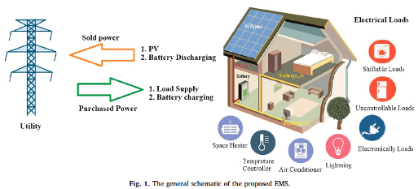
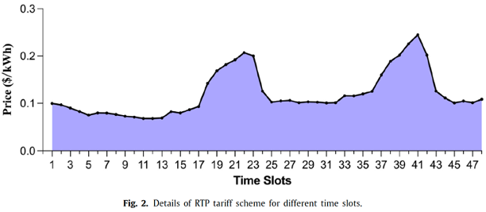
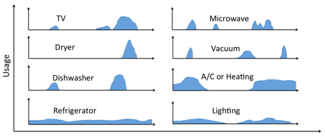
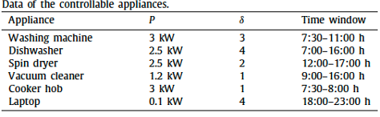
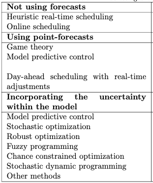

### HEM (home energy management)

- PVE energy generation (weather forecast) 
- Day-ahead energy prices 
- User comfort 
    
## TASK

- Propose an algorithm that will plan and optimize energy consumption 
- The lowest possible cost at the end of the month Some input data: 
  - Weather forecast 
  - PVE electricity production 
  - Energy consumption prediction 
  - Day-ahead energy price

### time investment
- time investment ~ 8 h
  - of which ~ 6 of understanding the problem
  - 2h some coding

### biblio summary:

Basic insight into problematic:
- devices in household are scheduled to consume energy off peaks or when the electricity is produced by the PV.
- some load cannot be shifted as they would not be comfortable for the customer (microwave, ..)
- Battery storage is very useful to deal with peaks demands (you don't have to buy that much)
- Might be quite easy if the customer has predictable and flexible schedule
  - e.g. when at home, load can be distributed with less constrains
  - but for someone that has unpredictable schedule and is not much at home it can be much more difficult
  - => personalization will be important
- some basic trends:
  - you have to consider seasonality (available light, need for heating, etc..)
  - two energy price peaks (morning/noon and evening) correlated with demand
  
  - PV production limited to daytime
- Items on energy consumption list
  - good stuff for planing: heating, hto water, ac
  - peaky stuff: owen, dryer, kettle, microwave
  - base loads: fridge, lighting, ..
  - on demand: tv, pc, owen, ...
  - 
  - 
various studies available in the literature: 
- Different use cases are available -> need to narrow down to simple cases
- Multiple models to convert weather predictions + PV props to energy production available
  - Muzathik, 2014 
  - possible to use ML if we have the data

- Getting data about client schedule and demands will be important and essential asset.

- various case studies found in the literature including using the following:
  - ARIMA (auto-regressive integrated moving-average)
  - lin. regression, svm, NN, combination
  - fuzzy logic alghoritms
  - dynamic programming
  - stochastic approach
  - genetic algorithm 
    - [Song, Z., Guan, X., & Cheng, M. (2022). Multi-objective optimization strategy for home energy management system including PV and battery energy storage. Energy Reports, 8, 5396-5411.]
  - and many more:

    - [Beaudin, M., & Zareipour, H. (2015). Home energy management systems: A review of modelling and complexity. Renewable and sustainable energy reviews, 45, 318-335.]

## general steps to solve the problem
  1. mathematical definition of the problem
  - define cost / objective function with all the constrains
  - minimize it with respect to cost, comfort, peak-to-average ration, or a combination of these. 
# SOLUTION: concept overview: 
- sketch an underlying data structure that could be used for testing various optimization algorithms.
  - some concept shown in `app/` folder
- basic idea: optimization problem
  - each device has its price to run (run duration * energy consumption)
  - we want to run devices with minimal cost and maximum comfort (be prepader for consumption in peaks)
    - explore the space of possible combinations of running devices in the defined time windows
      - taking controllable appliances to plan them one by one ordered from the most 'expensive' 
      - get estimate for peak hours demand (from history or customer profile) and be ready for it (charged energy storage, hot water, ...)
    - choose the best compromise between price vs comfort (based on customer preferences)

